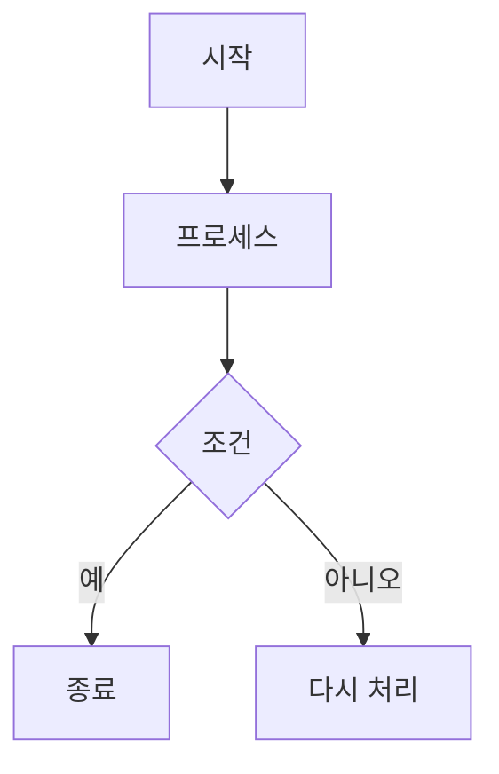
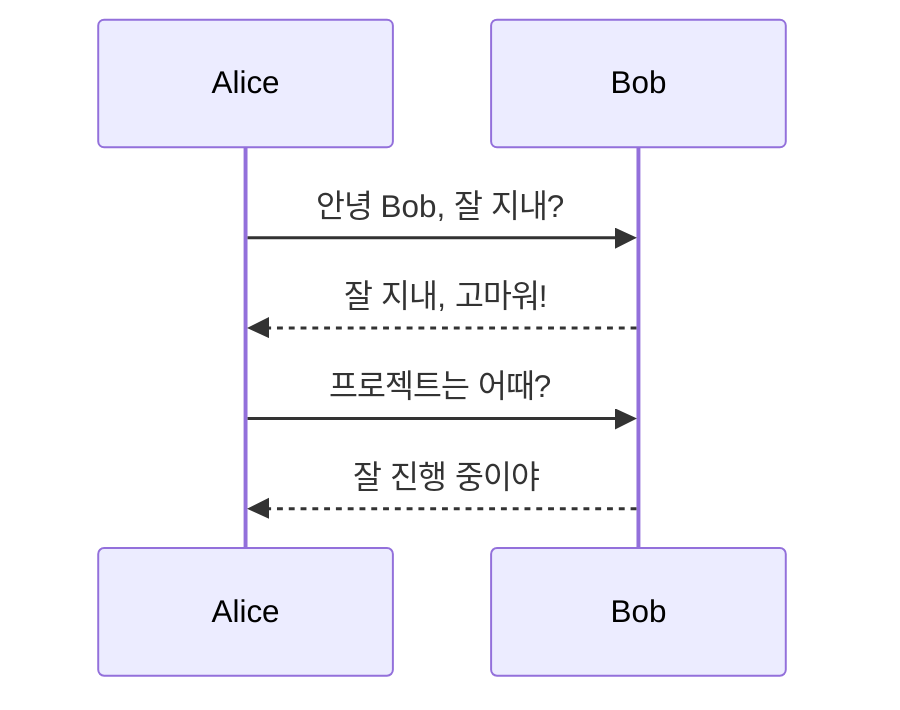
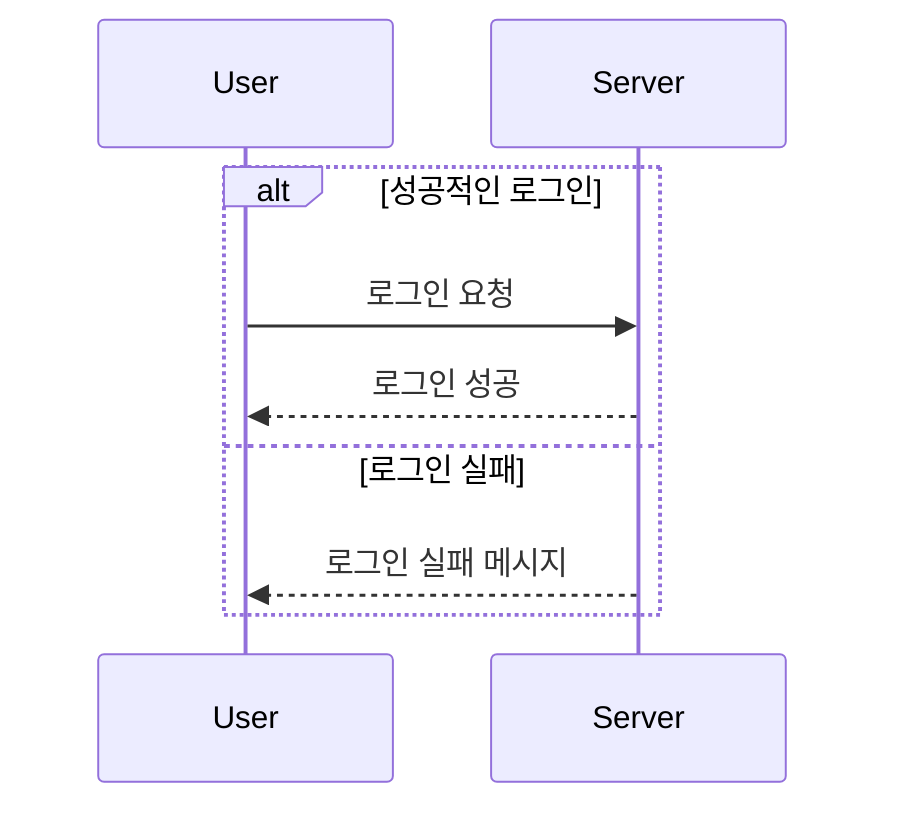
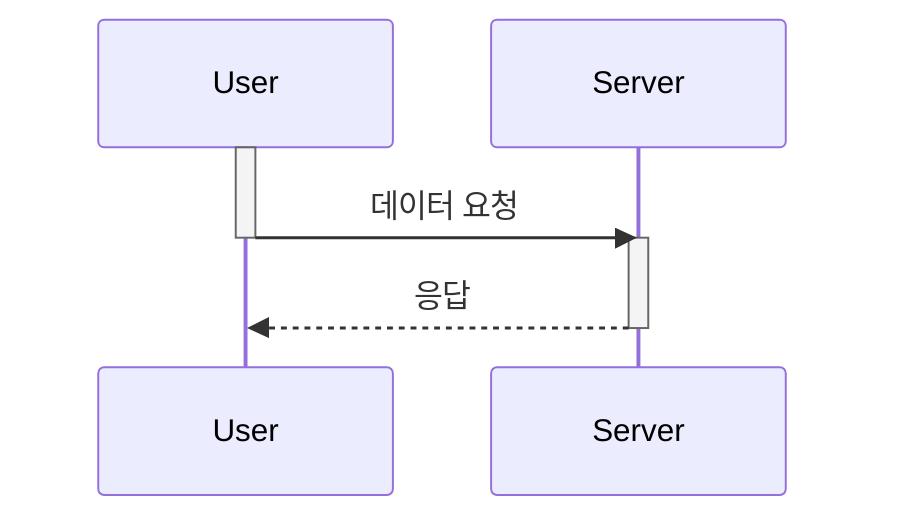
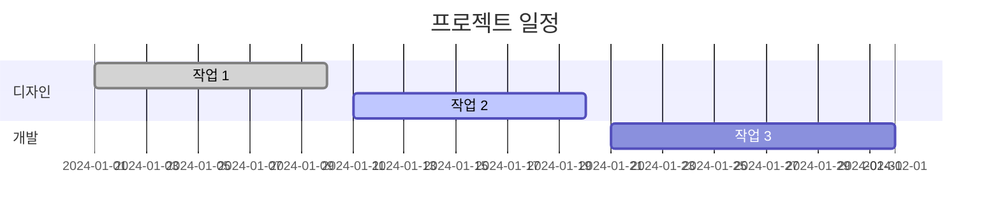
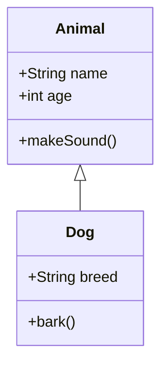
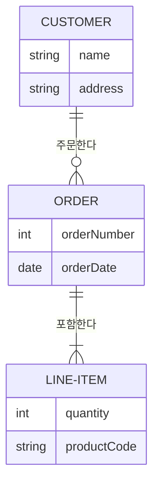
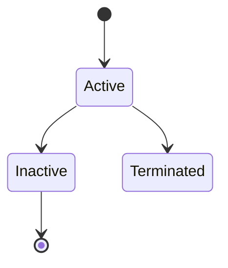
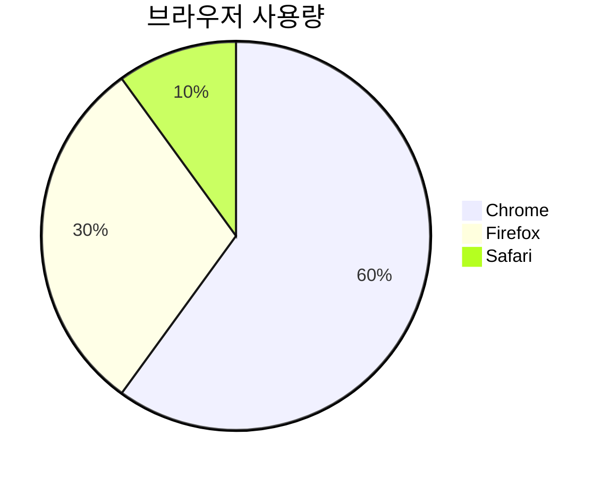

# 🧜 Mermaid Sequence Diagram


## Github 및 LiveEditor

[Mermaid Official Github](https://github.com/mermaid-js/mermaid)     [Mermiad Live Editor](https://mermaid.live/)

## **Mermaid란**

* **정의**: 코드를 기반으로 여러 종류의 다이어그램을 그릴 수 있게 해주는 오픈 소스 도구.
* **장점**: 직관적인 문법, 빠른 다이어그램 생성, 다양한 다이어그램 지원.
* **적용 분야**: 기술 문서화, 아키텍처 다이어그램, 워크플로우 시각화 등.

## **적용하게 된 이유**

* 회사에서 별도 워크플로우 문서 없이 작업을 하다보니 헷갈리는 경우가 많았다. \
  검색 하다가 코드로 워크플로우를 작성할 수 있다고 하여 실제 업무에 적용해보았다.&#x20;
* 실제로 어느정도의 복잡도 조차 커버할 정도로 뛰어났으며, 문법은 굉장히 간단했다.
* 다만 플로우가 "많이" 복잡하다면 다른 툴을 고려해보는 것이 나을 것 같다.

## **Mermaid 기본문법**

### 1. **플로우차트 (Flowchart)**



* **방향**:
  * `TD` (위에서 아래로)
  * `LR` (왼쪽에서 오른쪽으로)
  * `BT` (아래에서 위로)
  * `RL` (오른쪽에서 왼쪽으로)
* **노드 모양**:
  * `A[텍스트]` - 사각형
  * `A((텍스트))` - 원형
  * `A{"텍스트"}` - 다이아몬드 (조건)

***

### 2. **시퀀스 다이어그램 (Sequence Diagram)**



* **참여자 정의**: `participant`로 참여자를 정의
* **화살표 종류**:
  * `->>`: 실선 화살표 (메시지)
  * `-->>`: 점선 화살표 (응답)


* &#x20;**조건문 (alt, opt, loop)**
  * **alt/else/end**: 조건문 블록을 구성해 시퀀스 흐름을 제어.
  * **opt**: 조건이 있을 때만 실행되는 선택적 블록.
  * **loop**: 반복되는 동작을 나타낼 때 사용.




* **`->>+`** 와 **`->>-`**: 강조하여 특정 액션 시작/종료 표시.
* **Note**: 특정 구간에 설명을 추가.

```mermaid
sequenceDiagram
  participant User
  participant Server

  User->>Server: 데이터 요청
  Server-->>User: 응답

  Note over User: 요청이 완료됨

  Server->>+Database: 데이터 저장
  Server-->>-Database: 저장 완료
```


* **activate/deactivate**: 객체가 활성화/비활성화 상태임을 나타냄.



***

### 3. **간트 차트 (Gantt Chart)**



* **작업 상태**:
  * `done`: 완료된 작업
  * `active`: 진행 중인 작업
  * `des3`: 상태 없이 정의된 작업

***

### 4. **클래스 다이어그램 (Class Diagram)**



* **클래스 문법**:
  * `+`: Public 멤버
  * `-`: Private 멤버
  * `#`: Protected 멤버
* **상속 관계**:
  * `<|--`: 상속(일반화)

***

### 5. **ER 다이어그램 (ERD)**



* **관계 유형**:
  * `||--||`: 일대일 관계
  * `||--o{`: 일대다 관계
  * `|{--o{`: 다대다 관계

***

### 6. **상태 다이어그램 (State Diagram)**



* **상태 전환**:
  * `[Start] --> State`로 상태 전환을 정의.

***

### 7. **파이 차트 (Pie Chart)**



* **제목**: `title`로 차트 제목을 설정.
