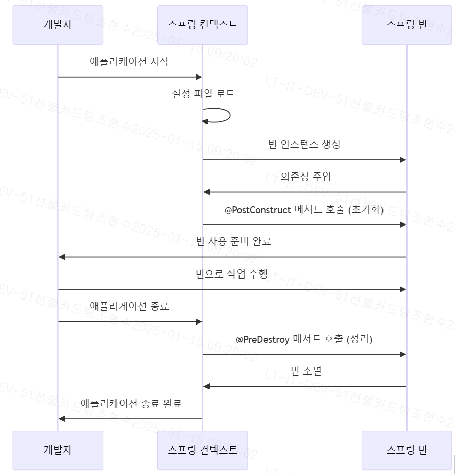

# 🪙 Json Web Token

## **JWT 란?**

JWT는 Json Web Token의 약자로 일반적으로 클라이언트와 서버 사이에서 통신할 때 \
권한을 위해 사용하는 토큰이다. 웹 상에서 정보를 Json형태로 주고 받기 위해 표준규약에 따라 생성한 \
암호화된 토큰으로 복잡하고 읽을 수 없는 string 형태로 저장되어있다.

<figure><figcaption><p>출처 : <a href="https://jwt.io/">https://jwt.io/</a></p></figcaption></figure>

## **JWT의 구조**

```
┌────────────┐   ┌─────────────┐   ┌──────────────┐
│   Header   │ . │   Payload   │ . │   Signature  │
└────────────┘   └─────────────┘   └──────────────┘

Header      : aaaaaa
Payload     : bbbbbb
Signature   : cccccc
```

### &#x20;헤더 (Header)

* 토큰의 타입과 암호화 알고리즘 정보를 포함.
* 예: `"typ": "JWT"`, `"alg": "HS256"`.
* Base64Url 인코딩하여 JWT의 첫 번째 부분 구성.

### 페이로드 (Payload)

* 사용자 정보와 클레임(claim) 데이터가 담긴 부분.
* 예: `{"sub": "1234567890", "name": "John Doe"}`.
* 여러 클레임을 포함하며 Base64Url 인코딩됨.

### 서명 (Signature)

* 헤더와 페이로드를 결합하여 비밀 키로 서명.
* 위변조 방지를 위해 사용, 해싱 알고리즘 적용.
* 최종 Base64Url 인코딩 후 JWT의 세 번째 부분이 됨.

## **JWT의 장점**

### 보안 이슈 적음 <a href="#undefined" id="undefined"></a>

* 쿠키 또는 세션을 탈취하여 발생하는 보안 이슈 예방 가능
* JWT는 쿠키를 사용하지 않기 때문에, Cross-Origin Resource Sharing (CORS) 이슈가 발생하지 않음.

### 데이터 크기 작음 <a href="#undefined-1" id="undefined-1"></a>

* `JWT`는 기존의 `XML`보다 덜 복잡하고 인코딩 된 사이즈가 작음.
* `HTTP`와 `HTML` 환경에 적용이 상대적으로 편함.

### 사용성 <a href="#undefined-2" id="undefined-2"></a>

* 서버 확장시, 토큰 정보만 공유하면되므로 사용성이 용이함.
* 토큰 기반으로 하는 다른 인증 시스템과 상호 호환 가능
* 토큰에 필요한 별도의 저장소 관리를 할 필요가 없음

## **JWT 토큰 사용 과정**

JWT 를 실제로 서버에서 사용 하는 과정을 그려보면 아래와 같다.

<figure><figcaption></figcaption></figure>
