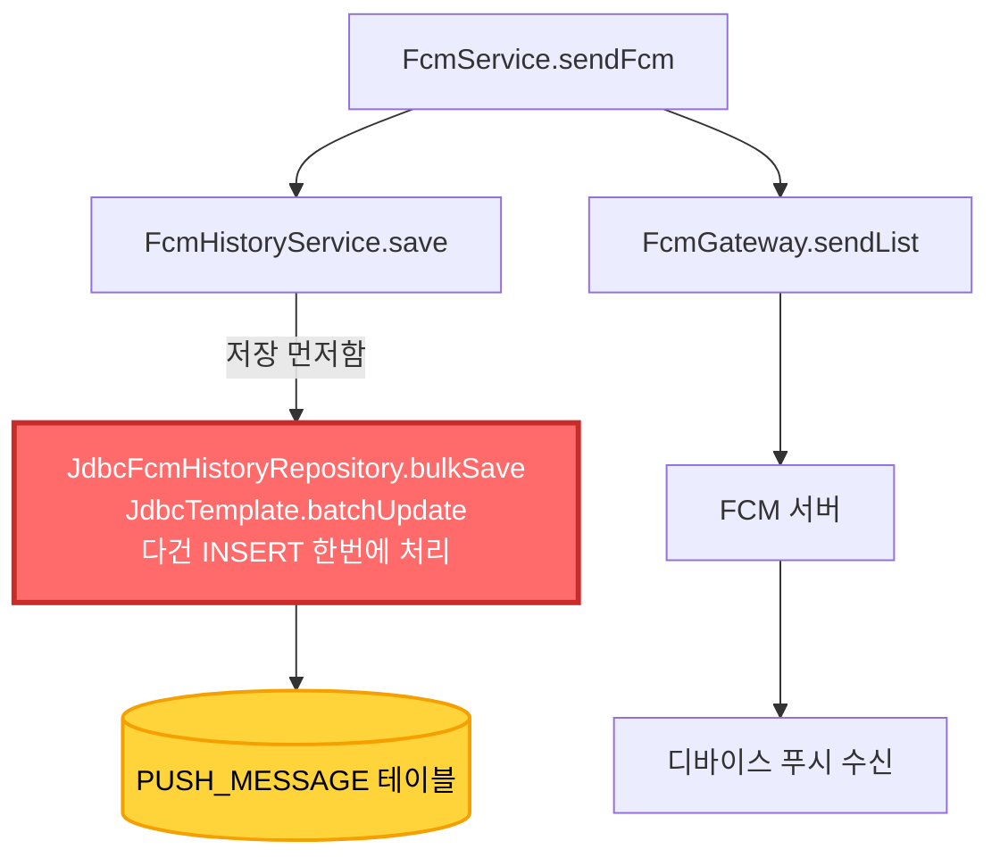

---
layout:
  width: default
  title:
    visible: true
  description:
    visible: true
  tableOfContents:
    visible: true
  outline:
    visible: true
  pagination:
    visible: true
  metadata:
    visible: true
---

# 🤔 백오피스 푸시 대량발송, 왜 다른 서버가 느려졌을까?

최근 회사 슬랙에 이런 공지가 올라왔습니다.

> **\[백오피스 푸시 기능 공지]** 최근 백오피스에서 무분별한 푸시발송으로 인해 타 서버가 느려져서 사용자들에게 앱 사용을 불편하게 만드는 일이 늘어나고 있습니다.

* 2025-11-05 18:25 부터 3분 사이 약 10만건 발송으로 앱접속 장애, 편의점 충전 장애 발생
* 2025-11-21 12:16 부터 4분 사이 약 9만건 이상 발송으로 앱 접속 장애 발생

3\~4분 사이에 9\~10만건의 푸시를 발송했더니 타 서비스에 이슈가 발생했다는 내용입니다. \
이번 포스팅에서는 **왜 푸시 대량 발송이 병목 현상을 일으켰는지**, \
그리고 어떻게 개선할 수 있는지 알아보겠습니다.

### 원인

다른 서버의 장애 이유는 거대 배치로 인한 DB 커넥션 장기 점유입니다.

먼저 간략한 앱 푸쉬 전송 흐름도를 확인 해보면 들어온 요청 건 수 만큼 벌크인서트를 진행하고있습니다.

문제는 해당 부분입니다.



### 왜 DB 커넥션 점유가 왜 길어졌을까?

#### 1. rewriteBatchedStatements 옵션 설정 부재

위 흐름도에서 볼 수 있 듯 `PUSH_MESSAGE` 테이블에 벌크 인서트를 진행합니다. 그런데 해당 프로젝트에는 `rewriteBatchedStatements` 옵션이 빠져있었습니다. `rewriteBatchedStatements`가 `false` (기본값)인 경우, JDBC 드라이버는 여러 개의 INSERT 또는 UPDATE 명령문을 **하나의 배치(Batch)로 서버에 보내지 않고** **각 명령문을 개별적으로 서버에 보내고 실행**합니다.

이는 네트워크 오버헤드를 크게 증가시키며, 특히 대량의 데이터를 배치 처리할 때 성능이 매우 느려집니다.

```sql
-- rewriteBatchedStatements=false (기본값)
-- 10만건 = 10만번의 개별 쿼리 실행
INSERT INTO push_message (token, title) VALUES ('token1', 'title1');
INSERT INTO push_message (token, title) VALUES ('token2', 'title2');
INSERT INTO push_message (token, title) VALUES ('token3', 'title3');
-- ... 10만번 반복 (네트워크 왕복 10만번!)

-- rewriteBatchedStatements=true
-- 여러 INSERT를 하나의 멀티 INSERT로 변환
INSERT INTO push_message (token, title) VALUES 
('token1', 'title1'),
('token2', 'title2'),
('token3', 'title3'),
...
('token100000', 'title100000');
-- 네트워크 왕복 1번!
```

#### 2. 배치 크기 관리 부재

해당 프로젝트는 리스트의 수만큼 벌크 인서트를 진행합니다. 즉, **10만건의 요청이 들어오면 10만건을 한번에 DB에 저장**하려고 시도합니다.

이 경우 아래와 같은 문제들이 발생합니다.

~~++ 나중에 알게된 사실인데 BO에서 청크처리하여 보낸다고합니다. 배치/청크 관리주체를 Message 애플리케이션으로 옮기면 어떨지?~~

* DB 커넥션이 10만건 처리할 때까지 **계속 점유**
* 메모리 사용량 증가
* 다른 서비스가 DB 커넥션을 못 얻음 → 타임아웃 발생
* 결과적으로 앱 접속, 충전 등 다른 기능 장애 발생

#### 3. 커넥션 풀 설정 최적화 필요

커넥션 풀을 단순히 늘리기보다 어느정도 표준화된 계산을 통해 최적화해야 합니다.

HikariCP 커넥션 풀 크기 계산 공식을 사용해볼 수 도 있습니다.

`connections = ((CPU 코어 수 * 2) + DB 디스크 스핀들 수) / WAS 인스턴스 수`

**예시**

```sql
# was 2대라고 가정
connections = ((8 * 2) + 0) / 2 = 8

spring:
  datasource:
    hikari:
      maximum-pool-size: 8         # 16 / 2 = 8
      minimum-idle: 3              # 최대의 1/3 정도
      connection-timeout: 30000
      idle-timeout: 600000
      max-lifetime: 1800000
```

### 결론

푸시 대량 발송 문제는 **DB 커넥션이라는 제한된 리소스의 효율적 사용에 대한 문제**였습니다.

위와 같은 개선들을 거치면 조금 더 단단한 시스템으로 개선 할 수 있지 않을까 생각해봅니다.

물론 지속적인 모니터링과 또 다른 병목 체크는 필수입니다.
